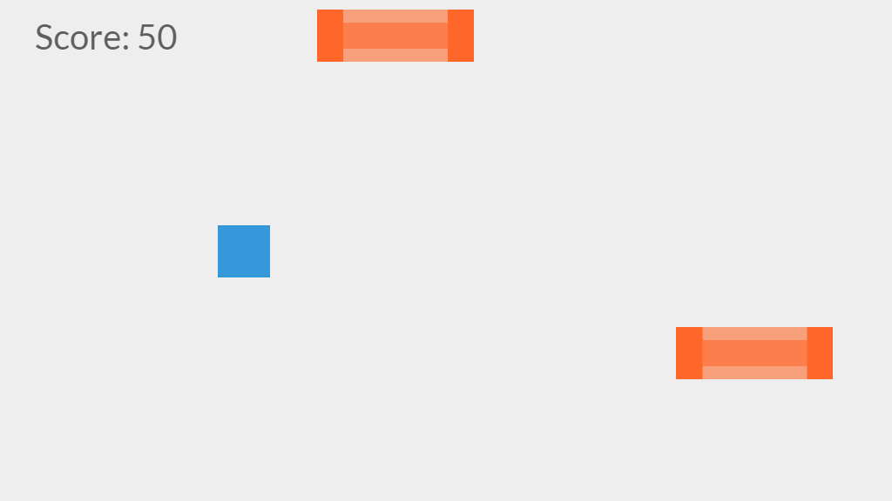

# Rush Of The Cube
## An adventure of the Cube

An **open source** infinite runner game built with the Phaser game engine featuring **the Cube**.

Only one thing... click/tap spacebar to jump and avoid obstacles!

The game should work on mobile, but it hasn't been tested yet...

You should be able to play the game if your browser [supports the `<canvas>` tag.](http://caniuse.com/#feat=canvas)

More features coming soon!

Images created in Inkscape ([the website](https://inkscape.org)), audio created in Audacity ([the website](http://audacityteam.org/)).

The Phaser HTML5/Javascript game engine is available at [the official website](http://phaser.io) and [the Github repo](https://github.com/photonstorm/phaser).

## Features
* Scoring and basic gameplay works
* Hiscores! Local storage is used but there is a fallback.
* Spacebar, screentap (with mobile) and mouse click for input
* Game resizes when screen resizes maintaining aspect ratio (but with white bars on the side)

## Note about svgs
The svg sources are raw. The svgs are not optimised, as they contain **lots** of Inkscape metadata. 

## Will the game self destruct my computer?
Probably...

## Screenshots!

## License

Licensed under the MIT license.
