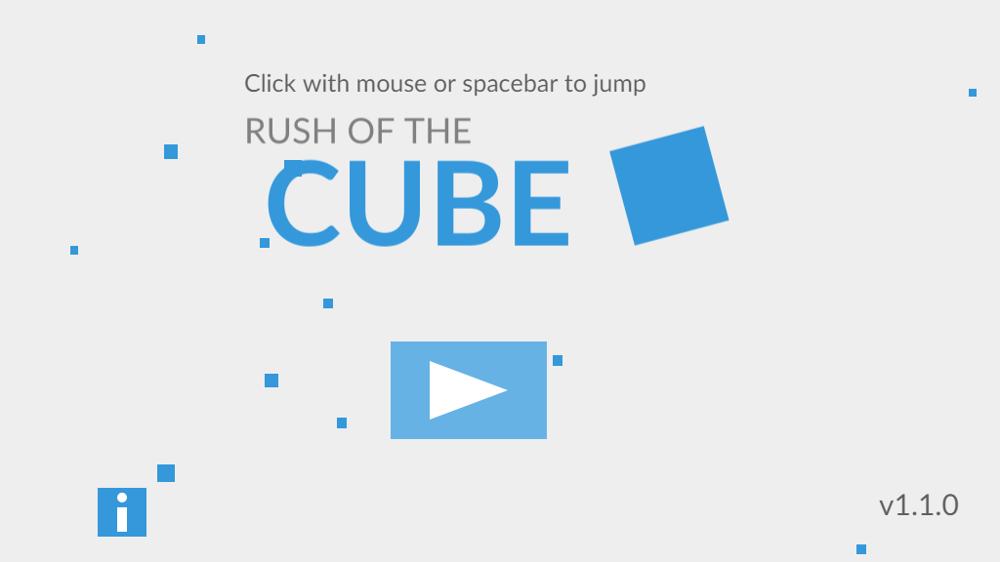

# Rush Of The Cube
## An adventure of the Cube

An **open source** infinite runner game built with the Phaser game engine featuring **the Cube**.

Only one thing... click/tap spacebar to jump and avoid obstacles!

The game should work on mobile, but it hasn't been tested on mobile yet...

More features coming soon!

Images created in Inkscape, audio created in Audacity.

## Note about svgs
The svg sources are raw. The svgs are not optimised, as they contain **lots** of Inkscape metadata. 

## Will the game self destruct my computer?
Probably...

## Screenshots!

## License

Licensed under the MIT license.
